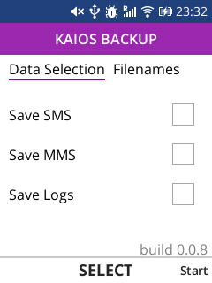

# KaiOS-Backup




## Start

```console
npm run start
# or
yarn start
```

## Build app

```console
npm run build
# or
yarn build
```

## Send the app to a KaiOS device

```console
npm run app:install
# or
yarn app:install
```