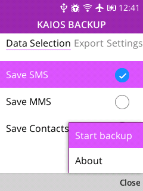

# KaiOS Backup

## Screenshot

## Description

KaiOS Backup uses mozilla's APIs to backup data. Currently it has options to export SMS, MMS and Contacts. This data can be exported to the following formats - 

- Plain Text File (.txt)
- JSON (The best option if you want to keep the native structure)
- CSV (Has option to export Contacts to Google and Outlook Contacts CSV format)
- XML

The program was tested on Nokia 8110 4g with KaiOS 2.5.1.

## Notes

- To export contacts to Google CSV and Outlook CSV formats just select "Export to CSV format" in the Export tab
- Google and Outlook CSV Supports up to 2 different numbers, 1 address and 2 email addresses (Perhaps I will change it later to include more fields)

## For the future (To-Do)

- Test program on different systems
- Investigate Import of data to the system
- Check the possibility of importing and Exporting Call logs and Calendar marks (At least for KaiOS 2.5.1 there are no APIs for that)

## How to install

- Use [Bananahackers guide](https://wiki.bananahackers.net/sideloading/webide) on how to install applications ([Old Wiki guide](https://ivan-hc.github.io/bananahackers/install-omnisd.html#h.p_9Fk5jizGWpwi)) 