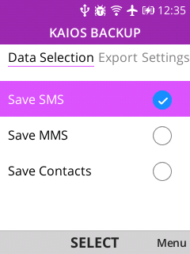

# KaiOS Backup

## Table of Contents
- [Screenshots](#screenshots)
- [Description](#description)
- [Building the App](#building-the-app)
- [WebIde (Debugging)](#webide-debugging)
- [FAQ](#faq)
- [Future Plans (To-Do)](#future-plans-to-do)
- [How to install](#how-to-install)

## Screenshots

 

See [docs/README.md](./docs/README.md) for more screenshots.

## Description

KaiOS Backup uses mozilla's APIs to backup data. 
It allows users to export SMS, MMS, and Contacts in various formats, including:

- Plain Text File (.txt)
- JSON (ideal for preserving the native structure)
- CSV (with options for Google and Outlook Contacts CSV formats)
- XML

### Additional Notes

- The program was tested on Nokia 8110 4g with KaiOS 2.5.1.
- The program uses [CSVPapa](https://www.papaparse.com/) to convert data to CSV format and [xml-js](https://www.npmjs.com/package/xml-js) to convert data to XML format.

## Building the app

### Prerequisites
- Install [Node.js](https://nodejs.org/en/download/)

### Steps
1. Clone the repository:
   ```
   git clone https://github.com/D3SXX/kaios-backup.git
   ```
2. Navigate to the project directory:
   ```
   cd kaios-backup
   ```
3. Install node dependencies:
   ```
   npm install
   ```
4. Build the app:
   ```
   npm run build
   ```
5. Retrieve the `app.zip` file from the `build` folder and install it (e.g., via [OmniSD](https://wiki.bananahackers.net/en/sideloading)).


### WebIde (debugging)

To use WebIde, select the `dist` folder and run:
```
npm run dev
```

## FAQ

### How to import exported SMS and MMS data?
- You can import SMS and MMS data to an Android device. [For more details, see this guide](/convert/README.md).

### How to export contacts in Google CSV and Outlook CSV formats?
- Navigate to "Export to CSV Format" in the Export page, press Options (softleft key) and select your preferred format.

### How many contacts can be exported for Outlook CSV?
- Google and Outlook CSV support up to 2 phone numbers, 1 address, and 2 email addresses.

### How to enable debug output?
- Press the "#" key once to toggle debug output.

## Future Plans (To-Do)
- Test program on different systems
- Add additional data selection options

## How to install

Follow the [Bananahackers guide](https://wiki.bananahackers.net/en/sideloading) for application installation ([Old Wiki guide](https://ivan-hc.github.io/bananahackers/install-omnisd.html#h.p_9Fk5jizGWpwi)).
